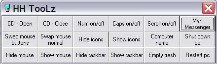



## A\*\*\*\*\*\*\*\*KewL\*TewL\*\*\*\*\*\*\*\*\*CD\*HIDE\*API\*NEW\*\*\*

### Description

This shows a bunch of api calls and how to use them. CD door open/close, Flip screen, Empty trash, Hide mouse, Hide taskbar, Hide desktop, MSN Messenger stuff, Restart/Shutdown PC. This is my first zip submission, and I'm not sure if I did it right. All you need is the Form, Mod and Project. Right ?
 
### More Info
 
This shows you how api works

I am running XP Home.. and after i close application i get an error. I found it was the way i am using open/close CD door, but I dont know why the error. If you know why please tell me the correct way.

             |
---                |---
**Submitted On**   |2003-05-07 22:33:44
**By**             |[HH](https://github.com/Planet-Source-Code/PSCIndex/blob/master/ByAuthor/hh.md)
**Level**          |Intermediate
**User Rating**    |3.6 (32 globes from 9 users)
**Compatibility**  |VB 6\.0
**Category**       |[Windows API Call/ Explanation](https://github.com/Planet-Source-Code/PSCIndex/blob/master/ByCategory/windows-api-call-explanation__1-39.md)
**World**          |[Visual Basic](https://github.com/Planet-Source-Code/PSCIndex/blob/master/ByWorld/visual-basic.md)
**Archive File**   |[A\_\_\_\_\_\_\_\_K158484572003\.zip](https://github.com/Planet-Source-Code/hh-a-kewl-tewl-cd-hide-api-new__1-45328/archive/master.zip)

